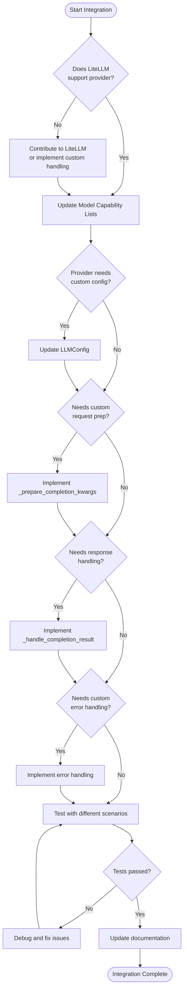
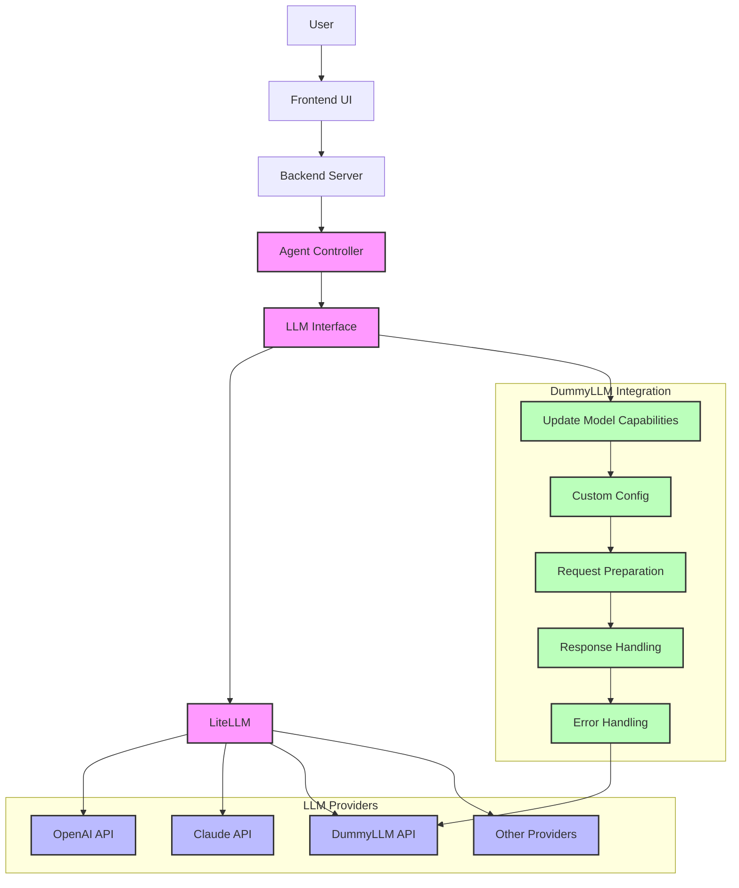

# Adding New Model Providers to OpenHands

This guide provides step-by-step instructions for adding support for new LLM providers to OpenHands.

## Overview

OpenHands leverages [LiteLLM](https://litellm.vercel.app) as its abstraction layer for interacting with different LLM providers. This simplifies the process of adding new model providers considerably, as LiteLLM handles most of the provider-specific implementation details.

## Prerequisites

Before adding a new provider, ensure you have:

1. A working OpenHands installation
2. Access to the API of the model provider you want to add
3. API credentials for the provider
4. Basic understanding of Python and the provider's API

## Step-by-Step Guide

### 1. Check LiteLLM Support

First, check if LiteLLM already supports your model provider. Visit [LiteLLM Supported Providers](https://docs.litellm.ai/docs/providers) for the current list.

If your provider is already supported by LiteLLM, most of the work is already done! If not, you may need to contribute to LiteLLM first or implement custom handling.

### 2. Update Model Capability Lists

OpenHands maintains lists of models with specific capabilities in `openhands/llm/llm.py`. Add your model to the appropriate lists:

```python
# Add models that support function calling
FUNCTION_CALLING_SUPPORTED_MODELS = [
    # existing models...
    'your-new-model',
]

# Add models that support cache prompt (if applicable)
CACHE_PROMPT_SUPPORTED_MODELS = [
    # existing models...
    'your-new-model',
]

# Add models that support reasoning effort (if applicable)
REASONING_EFFORT_SUPPORTED_MODELS = [
    # existing models...
    'your-new-model',
]

# Add models without stop words (if applicable)
MODELS_WITHOUT_STOP_WORDS = [
    # existing models...
    'your-new-model',
]
```

### 3. Handle Provider-Specific Configuration

If your provider requires special configuration parameters, update the `LLMConfig` class in `openhands/core/config/llm_config.py`:

```python
class LLMConfig(BaseModel):
    # Existing fields
    model: str = ""
    api_key: str | None = None
    base_url: str | None = None
    
    # Add provider-specific fields
    your_provider_api_version: str | None = None
    your_provider_region: str | None = None
```

### 4. Add Provider-Specific Logic (if necessary)

If your provider needs special handling beyond what LiteLLM provides, modify the `LLM` class in `openhands/llm/llm.py`:

```python
def _prepare_completion_kwargs(self, messages, tools, tool_choice, reasoning_effort):
    # ... existing code ...
    
    model = self.config.model
    
    # Add provider-specific logic
    if model.startswith('your-provider-'):
        kwargs['custom_parameter'] = self.config.your_provider_api_version
    
    return kwargs
```

### 5. Handle Response Formatting (if necessary)

If your provider returns responses in a format that needs special handling:

```python
def _handle_completion_result(self, result):
    # ... existing code ...
    
    # Handle provider-specific response format
    if self.config.model.startswith('your-provider-'):
        # Custom handling code
        pass
        
    return response
```

### 6. Test Your Integration

Create a test configuration using your new provider:

```toml
# config.toml
[core]
workspace_base = "./workspace"

[llm]
model = "your-provider-model-name"
api_key = "your-api-key"
base_url = "https://api.your-provider.com/v1" # if needed
your_provider_api_version = "2023-05-15" # if needed
```

Run OpenHands with this configuration and test basic conversation functionality.

### 7. Update Documentation

Update the following documentation files:
1. Add your provider to the list of supported providers in `docs/modules/python/providers.md`
2. Document any provider-specific configuration options
3. Add examples of using your provider

## Detailed Case Study: Integrating "DummyLLM" Provider

Let's walk through a comprehensive case study of integrating a fictional "DummyLLM" provider into OpenHands. This case study will cover all aspects of the integration process, from initial setup to testing.

### Background

DummyLLM is a fictional LLM provider with the following characteristics:
- Offers multiple models: `dummyllm-base`, `dummyllm-pro`, and `dummyllm-expert`
- Requires a specific header for authentication (`X-DummyLLM-Auth`)
- Uses a non-standard response format for function calls
- Requires a region parameter for API routing

### Step 1: Check LiteLLM Support

First, we check LiteLLM's documentation and find that DummyLLM isn't directly supported. We have two options:
1. Contribute support to LiteLLM (preferred long-term solution)
2. Add custom handling in OpenHands (quicker short-term solution)

For this case study, we'll implement custom handling in OpenHands.

### Step 2: Configure LiteLLM for DummyLLM

Although LiteLLM doesn't have built-in support, we can leverage its generic provider capabilities. Add this to your configuration:

```toml
# config.toml
[llm]
model = "dummyllm-pro"
api_key = "your-dummyllm-api-key"
base_url = "https://api.dummyllm.com/v1"
```

### Step 3: Update Model Capability Lists

Next, we update the model capability lists in `openhands/llm/llm.py`:

```python
# Add models that support function calling
FUNCTION_CALLING_SUPPORTED_MODELS = [
    # existing models...
    'dummyllm-pro',
    'dummyllm-expert',
]

# Add models that support cache prompt (if applicable)
CACHE_PROMPT_SUPPORTED_MODELS = [
    # existing models...
    'dummyllm-expert',  # Only the expert model supports this feature
]

# Add models that support reasoning effort (if applicable)
REASONING_EFFORT_SUPPORTED_MODELS = [
    # existing models...
    'dummyllm-expert',  # Only the expert model supports this feature
]

# Models without stop words
MODELS_WITHOUT_STOP_WORDS = [
    # existing models...
    'dummyllm-base',
    'dummyllm-pro',
    'dummyllm-expert',
]
```

### Step 4: Add DummyLLM-Specific Configuration

Update the `LLMConfig` class in `openhands/core/config/llm_config.py`:

```python
class LLMConfig(BaseModel):
    # Existing fields
    model: str = ""
    api_key: str | None = None
    base_url: str | None = None
    
    # DummyLLM specific fields
    dummyllm_region: str | None = None
    dummyllm_timeout: int | None = 120  # Default timeout in seconds
    dummyllm_response_format: str | None = None  # Optional response format
```

### Step 5: Implement Special Handling for DummyLLM

Add custom handling in `openhands/llm/llm.py`:

```python
def _prepare_completion_kwargs(self, messages, tools, tool_choice, reasoning_effort):
    # Existing code for setting up kwargs
    kwargs = {
        "model": self.config.model,
        "messages": messages_to_use,
        # ... other standard parameters
    }
    
    # DummyLLM specific handling
    if self.config.model.startswith('dummyllm-'):
        # Add custom headers for DummyLLM auth
        kwargs["headers"] = {
            "X-DummyLLM-Auth": self.config.api_key,
        }
        
        # Add region parameter if specified
        if self.config.dummyllm_region:
            kwargs["region"] = self.config.dummyllm_region
            
        # Set custom timeout
        if self.config.dummyllm_timeout:
            kwargs["timeout"] = self.config.dummyllm_timeout
        
        # Configure response format if specified
        if self.config.dummyllm_response_format:
            kwargs["response_format"] = {"type": self.config.dummyllm_response_format}
        
        # For the expert model, add special parameters
        if "expert" in self.config.model:
            kwargs["advanced_reasoning"] = True
    
    return kwargs
```

### Step 6: Handle DummyLLM's Response Format

DummyLLM returns function calls in a non-standard format. We need to add special handling:

```python
def _handle_completion_result(self, result):
    # ... existing code ...
    
    # Handle DummyLLM-specific response format
    if self.config.model.startswith('dummyllm-'):
        # DummyLLM nests function calls under a 'function_execution' key instead of 'tool_calls'
        if hasattr(result.choices[0].message, 'function_execution') and result.choices[0].message.function_execution:
            # Convert DummyLLM format to standard format
            function_exec = result.choices[0].message.function_execution
            tool_calls = []
            
            # Convert each function execution to a standard tool call
            for idx, func_exec in enumerate(function_exec):
                tool_call = ChatCompletionMessageToolCall(
                    id=f"call_{idx}",
                    type="function",
                    function={
                        "name": func_exec.name, 
                        "arguments": func_exec.arguments
                    }
                )
                tool_calls.append(tool_call)
                
            # Replace with standard format
            result.choices[0].message.tool_calls = tool_calls
            result.choices[0].message.function_execution = None
            
    return result
```

### Step 7: Add Error Handling for DummyLLM's Specific Errors

DummyLLM might have specific error responses that need handling:

```python
from openhands.llm.retry_mixin import RetryMixin

# Add to the RetryMixin class in openhands/llm/retry_mixin.py
class RetryMixin:
    # ... existing code ...
    
    def _should_retry(self, exception):
        # ... existing retry logic ...
        
        # Add DummyLLM-specific retry conditions
        if hasattr(exception, 'status_code') and exception.status_code == 429:
            # DummyLLM rate limit error
            self.logger.warning("DummyLLM rate limit exceeded. Retrying...")
            return True
        
        if hasattr(exception, 'status_code') and exception.status_code == 503:
            # DummyLLM service temporarily unavailable
            self.logger.warning("DummyLLM service temporarily unavailable. Retrying...")
            return True
            
        # ... rest of existing code ...
```

### Step 8: Create Complete Test Configuration

Create a comprehensive test configuration:

```toml
# config.toml
[core]
workspace_base = "./workspace"

[llm]
model = "dummyllm-pro"
api_key = "your-dummyllm-api-key"
base_url = "https://api.dummyllm.com/v1"
dummyllm_region = "us-west-2"
dummyllm_timeout = 180  # 3 minutes
dummyllm_response_format = "json"

[sandbox]
# Other sandbox settings
```

### Step 9: Testing the Integration

Now test the integration with various scenarios:

1. **Basic conversation test**:
   ```bash
   # Start OpenHands with your test config
   make run
   
   # In the OpenHands UI, test basic conversation
   ```

2. **Function calling test**: Test whether your model correctly handles function calls by using a tool-using agent.

3. **Error handling test**: Temporarily use an invalid API key to confirm error handling works.

4. **Recovery test**: Test handling of network issues by temporarily disconnecting from the network during a request.

### Step 10: Performance Tuning

After basic functionality is working, tune performance:

```python
# In openhands/llm/llm.py

def _tokenize_for_dummyllm(self, text):
    """Custom tokenization for DummyLLM models"""
    # DummyLLM counts tokens differently - approximately 1 token per 4 characters
    return len(text) // 4

def _calculate_tokens(self, prompt, response=None):
    # ... existing code ...
    
    # DummyLLM-specific token calculation
    if self.config.model.startswith('dummyllm-'):
        prompt_tokens = self._tokenize_for_dummyllm(prompt)
        completion_tokens = 0
        if response:
            completion_tokens = self._tokenize_for_dummyllm(response)
        return TokenUsage(
            prompt_tokens=prompt_tokens,
            completion_tokens=completion_tokens,
            total_tokens=prompt_tokens + completion_tokens
        )
    
    # ... rest of existing code ...
```

### Step 11: Document the Integration

Create documentation for users:

```markdown
## Using DummyLLM with OpenHands

OpenHands supports DummyLLM's API. Available models:

- `dummyllm-base`: Basic model, good for simple tasks
- `dummyllm-pro`: Advanced model with function calling
- `dummyllm-expert`: Premium model with all features

### Configuration

```toml
[llm]
model = "dummyllm-pro"  # or dummyllm-base, dummyllm-expert
api_key = "your-dummyllm-api-key"
base_url = "https://api.dummyllm.com/v1"

# Optional DummyLLM-specific settings
dummyllm_region = "us-west-2"  # API region
dummyllm_timeout = 180  # Request timeout in seconds
dummyllm_response_format = "json"  # Response format, options: "json", "text"
```

### Feature Support

| Model | Function Calling | Cache Prompt | Reasoning Effort |
|-------|-----------------|--------------|-----------------|
| dummyllm-base | ❌ | ❌ | ❌ |
| dummyllm-pro | ✅ | ❌ | ❌ |
| dummyllm-expert | ✅ | ✅ | ✅ |
```

### Implementation Results

After completing the integration:

1. OpenHands now supports DummyLLM's API with all of its models
2. Special features like region selection work correctly
3. Custom error handling improves reliability
4. Users can configure DummyLLM through standard configuration options
5. Documentation enables users to quickly start using DummyLLM

This comprehensive integration demonstrates how to handle provider-specific requirements while maintaining compatibility with the OpenHands framework.

## Troubleshooting

If you encounter issues:

1. Enable debug logging to see detailed API interactions
2. Check that your API credentials are correct
3. Verify that the model name format matches what the provider expects
4. Ensure you're using the correct base URL for the API
5. Check if you need to handle rate limits or token quotas

### Common Issues with Model Provider Integration

Here are some common issues you might encounter when adding a new model provider, using DummyLLM as an example:

#### 1. Authentication Failures

**Error message**: 
```
Error creating agent_session: AuthenticationError - Invalid API key
```

**Possible causes**:
- Incorrect API key
- API key not formatted correctly
- Custom authentication headers not properly set

**Solution for DummyLLM**:
```python
# Make sure custom headers are properly set
if self.config.model.startswith('dummyllm-'):
    kwargs["headers"] = {
        "X-DummyLLM-Auth": self.config.api_key,  # DummyLLM expects key in header
    }
```

#### 2. Timeout Errors

**Error message**:
```
Error creating agent_session: timed out when starting a conversation
```

**Possible causes**:
- Network connectivity issues
- Provider server is slow or overloaded
- Default timeout too short

**Solution for DummyLLM**:
```python
# Increase timeout for DummyLLM
if self.config.model.startswith('dummyllm-'):
    kwargs["timeout"] = self.config.dummyllm_timeout or 180  # 3 minutes
```

To fix the timeout error in OpenHands:
```bash
# Set longer timeout in config.toml
dummyllm_timeout = 300  # 5 minutes

# Or add retry logic in your code for this specific provider
```

#### 3. Response Format Issues

**Error message**:
```
Error creating agent_session: LLMMalformedActionError
```

**Possible causes**:
- Provider response format doesn't match expected format
- Function call format is different from standard

**Solution for DummyLLM**:
```python
# In _handle_completion_result, add conversion logic:
if self.config.model.startswith('dummyllm-'):
    # Convert from DummyLLM's format to standard format
    if hasattr(result.choices[0].message, 'function_execution'):
        # Conversion logic as shown in the case study
```

#### 4. Rate Limiting

**Error message**:
```
RateLimitError: Rate limit exceeded
```

**Solution for DummyLLM**:
```python
# Add exponential backoff retry logic
def retry_on_rate_limit(func):
    @functools.wraps(func)
    async def wrapper(*args, **kwargs):
        max_retries = 5
        for attempt in range(max_retries):
            try:
                return await func(*args, **kwargs)
            except RateLimitError:
                if attempt == max_retries - 1:
                    raise
                wait_time = 2 ** attempt  # Exponential backoff
                logger.info(f"Rate limited, retrying in {wait_time}s...")
                await asyncio.sleep(wait_time)
    return wrapper
```

#### 5. Model Capability Mismatch

**Error message**:
```
Error creating agent_session: LLMNoActionError
```

**Possible causes**:
- Model doesn't actually support function calls despite being listed
- Function call format is incorrect for this model

**Solution**:
Double-check model capabilities and update the capability lists accordingly.

## Integration Flow Diagram

The following diagram illustrates the process of integrating a new model provider like DummyLLM into OpenHands:



### Integration Architecture

This diagram shows how the new provider fits into the OpenHands architecture:



## Resources

- [LiteLLM Documentation](https://docs.litellm.ai/docs/)
- [OpenHands LLM Module](https://github.com/openhands/openhands/tree/main/openhands/llm)
- [OpenAI API Reference](https://platform.openai.com/docs/api-reference) (as a common format reference)
- [Example Provider Integration PR](https://github.com/BerriAI/litellm/pull/examples) - Example of adding a provider to LiteLLM
