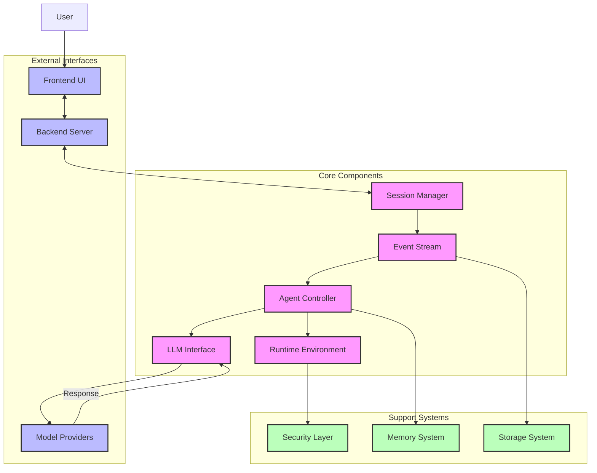
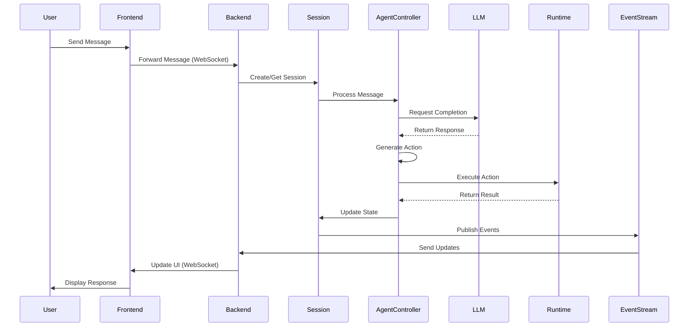
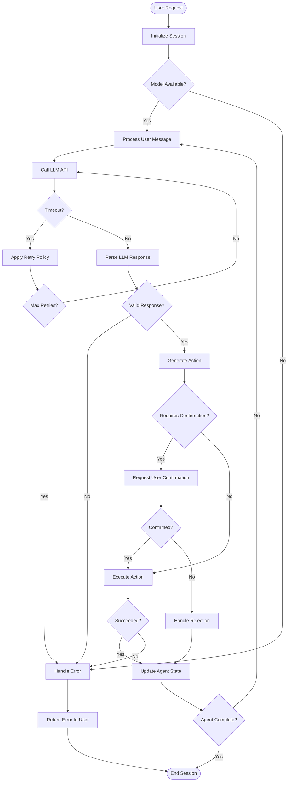

```mermaid
graph TD
    User[User] --> Frontend[Frontend UI]
    Frontend <--> Backend[Backend Server]
    Backend <--> Session[Session Manager]
    Session --> EventStream[Event Stream]
    EventStream --> AgentController[Agent Controller]
    AgentController --> LLM[LLM Interface]
    LLM --> ModelProviders[Model Providers]
    ModelProviders -->|Response| LLM
    AgentController --> Runtime[Runtime Environment]
    Runtime --> Security[Security Layer]
    AgentController --> Memory[Memory System]
    EventStream --> Storage[Storage System]
    
    subgraph "Core Components"
        Session
        AgentController
        LLM
        Runtime
        EventStream
    end
    
    subgraph "External Interfaces"
        Frontend
        Backend
        ModelProviders
    end
    
    subgraph "Support Systems"
        Security
        Storage
        Memory
    end
    
    classDef core fill:#f9f,stroke:#333,stroke-width:2px;
    classDef external fill:#bbf,stroke:#333,stroke-width:2px;
    classDef support fill:#bfb,stroke:#333,stroke-width:2px;
    
    class Session,AgentController,LLM,Runtime,EventStream core;
    class Frontend,Backend,ModelProviders external;
    class Security,Storage,Memory support;
```

```mermaid
sequenceDiagram
    participant User
    participant Frontend
    participant Backend
    participant Session
    participant AgentController
    participant LLM
    participant Runtime
    
    User->>Frontend: Send Message
    Frontend->>Backend: Forward Message (WebSocket)
    Backend->>Session: Create/Get Session
    Session->>AgentController: Process Message
    AgentController->>LLM: Request Completion
    LLM-->>AgentController: Return Response
    
    AgentController->>AgentController: Generate Action
    AgentController->>Runtime: Execute Action
    Runtime-->>AgentController: Return Result
    
    AgentController->>Session: Update State
    Session->>EventStream: Publish Events
    EventStream->>Backend: Send Updates
    Backend->>Frontend: Update UI (WebSocket)
    Frontend->>User: Display Response
```

```mermaid
flowchart TD
    Start([User Request]) --> Init[Initialize Session]
    Init --> ModelAvailable{Model Available?}
    ModelAvailable -->|Yes| ProcessMessage[Process User Message]
    ModelAvailable -->|No| HandleError[Handle Error]
    
    ProcessMessage --> CallLLM[Call LLM API]
    CallLLM --> Timeout{Timeout?}
    
    Timeout -->|Yes| RetryPolicy[Apply Retry Policy]
    RetryPolicy --> MaxRetries{Max Retries?}
    MaxRetries -->|Yes| HandleError
    MaxRetries -->|No| CallLLM
    
    Timeout -->|No| ParseResponse[Parse LLM Response]
    ParseResponse --> ValidResponse{Valid Response?}
    ValidResponse -->|No| HandleError
    ValidResponse -->|Yes| GenerateAction[Generate Action]
    
    GenerateAction --> RequiresConfirmation{Requires Confirmation?}
    RequiresConfirmation -->|Yes| RequestConfirmation[Request User Confirmation]
    RequestConfirmation --> Confirmed{Confirmed?}
    Confirmed -->|Yes| ExecuteAction[Execute Action]
    Confirmed -->|No| HandleRejection[Handle Rejection]
    
    RequiresConfirmation -->|No| ExecuteAction
    ExecuteAction --> ActionSucceeded{Succeeded?}
    
    ActionSucceeded -->|Yes| UpdateState[Update Agent State]
    ActionSucceeded -->|No| HandleError
    
    UpdateState --> AgentComplete{Agent Complete?}
    AgentComplete -->|Yes| End([End Session])
    AgentComplete -->|No| ProcessMessage
    
    HandleError --> ReturnError[Return Error to User]
    HandleRejection --> UpdateState
    ReturnError --> End
```
